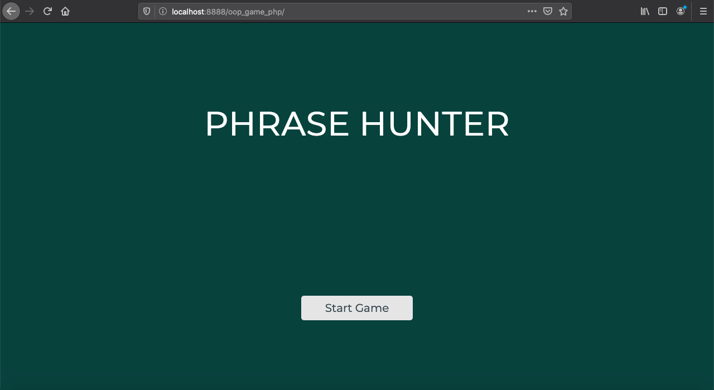
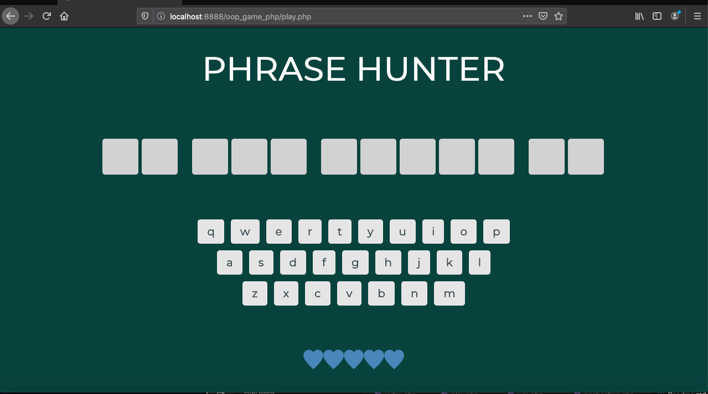

# OOP_GAME_PHP

**OOP_GAME_PHP** 

The OOP_GAME_PHP is a simple phrase guessing game allows the players to guess a collection of pre-defined phrases. This project build with PHP and demonstrated my understanding and ability to code in PHP object oriented programming. Hope you like it and happy coding!

Note: 

Teamtreehouse.com PHP Techdegree exceeding grade changes: background colors and keyboard styles of the app have been customized as my own.

## How to Play

git clone https://github.com/allan9595/OOP_GAME_PHP.git

Place the repo in a web server of your choice (XAMPP for Windows, MAMP for Mac)

Go to your web server's root path and navigate to the project folder and start to play!

## Screenshots

## License

   The MIT License

    Copyright (c) BOHAN ZHANG

    Permission is hereby granted, free of charge, to any person obtaining a copy
    of this software and associated documentation files (the "Software"), to deal
    in the Software without restriction, including without limitation the rights
    to use, copy, modify, merge, publish, distribute, sublicense, and/or sell
    copies of the Software, and to permit persons to whom the Software is
    furnished to do so, subject to the following conditions:

    The above copyright notice and this permission notice shall be included in
    all copies or substantial portions of the Software.

    THE SOFTWARE IS PROVIDED "AS IS", WITHOUT WARRANTY OF ANY KIND, EXPRESS OR
    IMPLIED, INCLUDING BUT NOT LIMITED TO THE WARRANTIES OF MERCHANTABILITY,
    FITNESS FOR A PARTICULAR PURPOSE AND NONINFRINGEMENT. IN NO EVENT SHALL THE
    AUTHORS OR COPYRIGHT HOLDERS BE LIABLE FOR ANY CLAIM, DAMAGES OR OTHER
    LIABILITY, WHETHER IN AN ACTION OF CONTRACT, TORT OR OTHERWISE, ARISING FROM,
    OUT OF OR IN CONNECTION WITH THE SOFTWARE OR THE USE OR OTHER DEALINGS IN
    THE SOFTWARE.